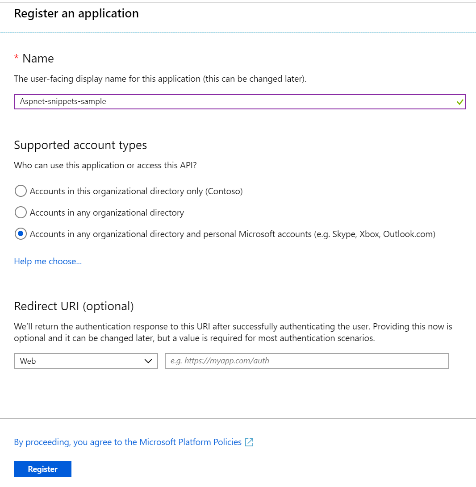
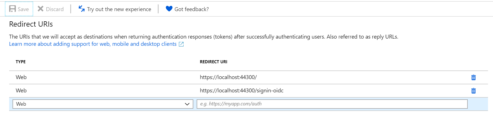
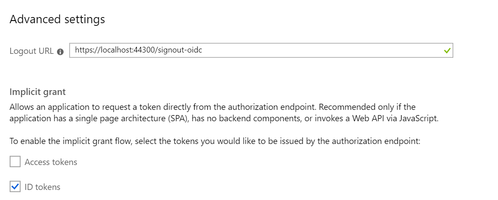
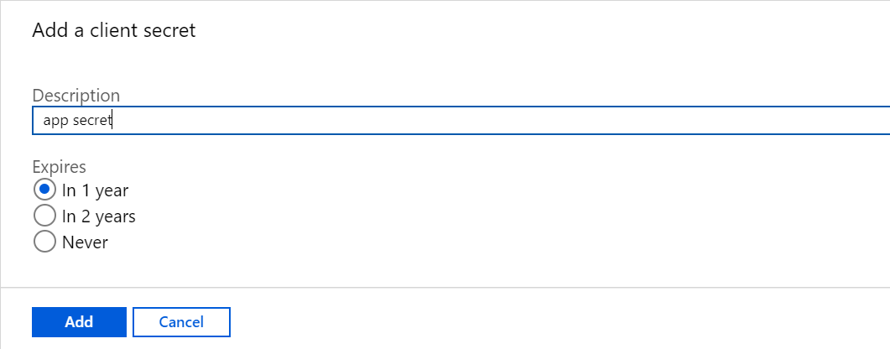
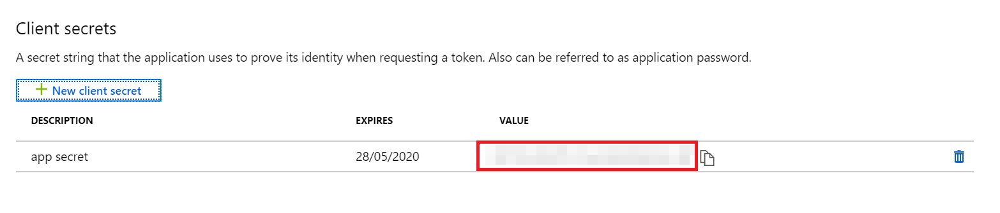
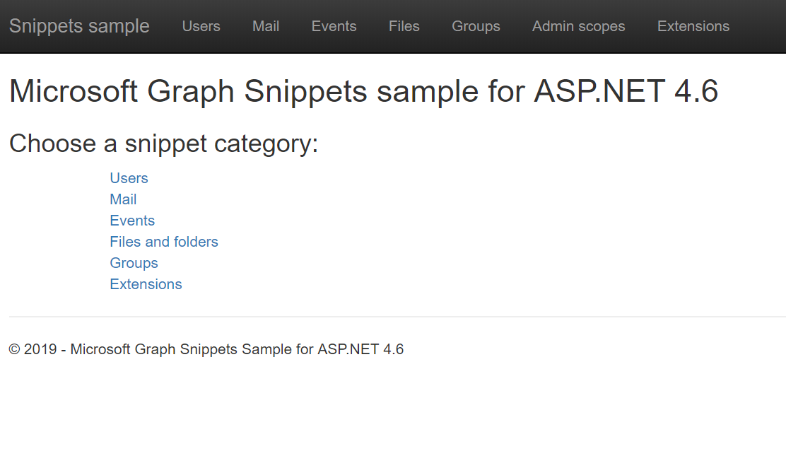

# Microsoft Graph Snippets Sample for ASP.NET 4.6

## Table of contents

* [Prerequisites](#prerequisites)
* [Register the application](#register-the-application)
* [Build and run the sample](#build-and-run-the-sample)
* [Code of note](#code-of-note)
* [Questions and comments](#questions-and-comments)
* [Contributing](#contributing)
* [Additional resources](#additional-resources)

This sample project provides a repository of code snippets that use the Microsoft Graph to perform common tasks, such as sending email, managing groups, and other activities from within an ASP.NET MVC app. It uses the [Microsoft Graph .NET Client SDK](https://github.com/microsoftgraph/msgraph-sdk-dotnet) to work with data returned by the Microsoft Graph. 

The sample uses the [Microsoft Authentication Library (MSAL)](https://www.nuget.org/packages/Microsoft.Identity.Client/) for authentication. The MSAL SDK provides features for working with the [Azure AD v2.0 endpoint](https://azure.microsoft.com/en-us/documentation/articles/active-directory-appmodel-v2-overview), which enables developers to write a single code flow that handles authentication for both work or school (Azure Active Directory) and personal (Microsoft) accounts.

In addition, the sample shows how to request tokens incrementally--a feature supported by the Azure AD v2.0 endpoint. Users consent to an initial set of permission scopes during sign in, but can consent to other scopes later. In the case of this sample, any valid user can sign in, but admininstrators can later consent to the admin-level scopes required for certain operations.

The sample uses the [ASP.NET OpenId Connect OWIN middleware](https://www.nuget.org/packages/Microsoft.Owin.Security.OpenIdConnect/) for sign in and during the initial token acquisition. The sample also implements custom Owin middleware to exchange an authorization code for access and refresh tokens outside of the sign-in flow. The custom middleware calls MSAL to build the authorization request URI and handles the redirects. To learn more about incremental consent, see [Integrate Microsoft identity and the Microsoft Graph into a web application using OpenID Connect](https://github.com/Azure-Samples/active-directory-dotnet-webapp-openidconnect-v2).

> This sample uses ASP.NET MVC 4.6. For samples that use ASP.NET Core, see one of these two samples: 
> - [Microsoft Graph Connect Sample for ASP.NET Core 2.1](https://github.com/microsoftgraph/aspnetcore-connect-sample)
> - [Enable your Web Apps to sign-in users and call APIs with the Microsoft identity platform for developers](https://github.com/Azure-Samples/active-directory-aspnetcore-webapp-openidconnect-v2)

## Important Note about the MSAL Preview

This library is suitable for use in a production environment. We provide the same production level support for this library as we do our current production libraries. During the preview we may make changes to the API, internal cache format, and other mechanisms of this library, which you will be required to take along with bug fixes or feature improvements. This may impact your application. For instance, a change to the cache format may impact your users, such as requiring them to sign in again. An API change may require you to update your code. When we provide the General Availability release we will require you to update to the General Availability version within six months, as applications written using a preview version of library may no longer work.

## Prerequisites

This sample requires the following:  

  * [Visual Studio](https://www.visualstudio.com/en-us/downloads) 
  * Either a [Microsoft account](https://www.outlook.com) or an [Office 365 for business account](https://msdn.microsoft.com/en-us/office/office365/howto/setup-development-environment#bk_Office365Account). An Office 365 administrator account is required to run admin-level operations. You can sign up for [an Office 365 Developer subscription](https://msdn.microsoft.com/en-us/office/office365/howto/setup-development-environment#bk_Office365Account) that includes the resources that you need to start building apps.

## Register the web app

### Choose the Azure AD tenant where you want to create the application

As a first step you'll need to:

1. Sign in to the [Azure portal](https://portal.azure.com) using either a work or school account or a personal Microsoft account.
1. If your account is present in more than one Azure AD tenant, select your profile at the top right corner in the menu on top of the page, and then **switch directory**.
   Change your portal session to the desired Azure AD tenant.

### Register the app

1. Navigate to the Microsoft identity platform for developers [App registrations](https://go.microsoft.com/fwlink/?linkid=2083908) page.
1. Select **New registration**.
1. When the **Register an application page** appears, enter your application's registration information:
   - In the **Name** section, enter a meaningful application name that will be displayed to users of the app.
   - Change **Supported account types** to **Accounts in any organizational directory and personal Microsoft accounts (e.g. Skype, Xbox, Outlook.com)**.
     > Note that there are more than one redirect URIs. You'll need to add them from the **Authentication** tab later after the app has been created successfully.  
     
1. Select **Register** to create the application.
1. On the app **Overview** page, find the **Application (client) ID** value and record it for later. You'll need it to configure the Visual Studio configuration file for this project.  

1. From the app's Overview page, select the **Authentication** section.
   - In the Redirect URIs section, select **Web** in the combo-box and enter the following redirect URIs.
       - `https://localhost:44300/`
       - `https://localhost:44300/signin-oidc`  
       
   - In the **Advanced settings** section set **Logout URL** to `https://localhost:44300/signout-oidc`
   - In the **Advanced settings** | **Implicit grant** section, check **ID tokens** as this sample requires
     the [Implicit grant flow](https://docs.microsoft.com/en-us/azure/active-directory/develop/v2-oauth2-implicit-grant-flow) to be enabled to
     sign-in the user, and call an API.  
     
1. Select **Save**.
1. From the **Certificates & secrets** page, in the **Client secrets** section, choose **New client secret**:
   - Type a key description (for instance `app secret`),
   - Select a key duration of either **In 1 year**, **In 2 years**, or **Never Expires**.  
   
   - When you press the **Add** button, the key value will be displayed. Copy and save the value in a safe location.
   - You'll need this key later to configure the project in Visual Studio. This key value will not be displayed again, nor is it retrievable by any other means,
     so record it as soon as it's visible from the Azure portal.  
     
 
## Build and run the sample

1. Download or clone the Microsoft Graph Snippets Sample for ASP.NET 4.6.

2. Open the sample solution in Visual Studio.

3. In the Web.config file in the root directory, replace the **ida:AppId** and **ida:AppSecret** placeholder values with the values that you copied during app registration.

4. Press F5 to build and run the sample. This will restore the NuGet package dependencies and open the app.

   >If you see any errors while installing packages, make sure the local path where you placed the solution is not too long/deep. Moving the solution closer to the root of your drive may resolve this issue.

5. Sign in with your personal account (MSA) or your work or school account, and grant the requested permissions. 

6. Choose a snippets category, such as Users, Files, or Mail.  

7. Choose an operation you want to run. Note the following:
  - Operations that require an argument (such as ID) are disabled until you run a snippet that lets you select an entity. 
  - Some snippets (marked as *admin-only*) require commercial permission scopes that can only be granted by an administrator. To run these snippets, you need to sign into the Azure portal as an admin. Then, use the *API permissions* section of the app's registration to consent to the admin-level scopes. This tab is not available for users who are logged in with personal accounts.
  - If you logged in with a personal account, snippets that aren't supported for Microsoft accounts are disabled.
   
Response information is displayed at the bottom of the page.

### How the sample affects your account data

This sample creates, updates, and deletes entities and data (such as users or files). Depending on how you use it, **you might edit or delete actual entities and data** and leave data artifacts. 

To use the sample without modifying your actual account data, be sure to perform update and delete operations only on entities that are created by the sample. 

## Code of note

- [Startup.Auth.cs](/Graph-ASPNET-46-Snippets/Microsoft%20Graph%20ASPNET%20Snippets/App_Start/Startup.Auth.cs). Authenticates the current user and initializes the sample's token cache.

- [SessionTokenCache.cs](/Graph-ASPNET-46-Snippets/Microsoft%20Graph%20ASPNET%20Snippets/TokenStorage/SessionTokenCache.cs). Stores the user's token information. You can replace this with your own custom token cache. Learn more in [Caching access tokens in a multitenant application](https://azure.microsoft.com/en-us/documentation/articles/guidance-multitenant-identity-token-cache/).

- [SampleAuthProvider.cs](/Graph-ASPNET-46-Snippets/Microsoft%20Graph%20ASPNET%20Snippets/Helpers/SampleAuthProvider.cs). Implements the local IAuthProvider interface, and gets an access token by using the **AcquireTokenSilentAsync** method. You can replace this with your own authorization provider. 

- [SDKHelper.cs](/Graph-ASPNET-46-Snippets/Microsoft%20Graph%20ASPNET%20Snippets/Helpers/SDKHelper.cs). Initializes the **GraphServiceClient** from the [Microsoft Graph .NET Client Library](https://github.com/microsoftgraph/msgraph-sdk-dotnet) that's used to interact with the Microsoft Graph.

- The following controllers contain methods that use the **GraphServiceClient** to build and send calls to the Microsoft Graph service and process the response.
  - [UsersController.cs](/Graph-ASPNET-46-Snippets/Microsoft%20Graph%20ASPNET%20Snippets/Controllers/UsersController.cs) 
  - [MailController.cs](/Graph-ASPNET-46-Snippets/Microsoft%20Graph%20ASPNET%20Snippets/Controllers/MailController.cs)
  - [EventsController.cs](/Graph-ASPNET-46-Snippets/Microsoft%20Graph%20ASPNET%20Snippets/Controllers/EventsController.cs) 
  - [FilesController.cs](/Graph-ASPNET-46-Snippets/Microsoft%20Graph%20ASPNET%20Snippets/Controllers/FilesController.cs)  
  - [GroupsController.cs](/Graph-ASPNET-46-Snippets/Microsoft%20Graph%20ASPNET%20Snippets/Controllers/GroupsController.cs) 

- The following views contain the sample's UI.  
  - [Users.cshtml](/Graph-ASPNET-46-Snippets/Microsoft%20Graph%20ASPNET%20Snippets/Views/Users/Users.cshtml)  
  - [Mail.cshtml](/Graph-ASPNET-46-Snippets/Microsoft%20Graph%20ASPNET%20Snippets/Views/Mail/Mail.cshtml)
  - [Events.cshtml](/Graph-ASPNET-46-Snippets/Microsoft%20Graph%20ASPNET%20Snippets/Views/Events/Events.cshtml) 
  - [Files.cshtml](/Graph-ASPNET-46-Snippets/Microsoft%20Graph%20ASPNET%20Snippets/Views/Files/Files.cshtml)  
  - [Groups.cshtml](/Graph-ASPNET-46-Snippets/Microsoft%20Graph%20ASPNET%20Snippets/Views/Groups/Groups.cshtml)

- The following files contain the view models and partial view that are used to parse and display Microsoft Graph data as generic objects (for the purposes of this sample). 
  - [ResultsViewModel.cs](/Graph-ASPNET-46-Snippets/Microsoft%20Graph%20ASPNET%20Snippets/Models/ResultsViewModel.cs)
  - [_ResultsPartial.cshtml](/Graph-ASPNET-46-Snippets/Microsoft%20Graph%20ASPNET%20Snippets/Views/Shared/_ResultsPartial.cshtml)  

- The following files contain code used to support incremental consent. For this sample, users are prompted to consent to an initial set of permissions during sign in, and admin permissions separately. 
  - [AdminController.cs](/Graph-ASPNET-46-Snippets/Microsoft%20Graph%20ASPNET%20Snippets/Controllers/AdminController.cs)
  - [OAuth2CodeRedeemerMiddleware.cs](/Graph-ASPNET-46-Snippets/Microsoft%20Graph%20ASPNET%20Snippets/Utils/OAuth2CodeRedeemerMiddleware.cs). Custom middleware that redeems an authorization code for access and refresh tokens outside of the sign-in flow. See https://github.com/Azure-Samples/active-directory-dotnet-webapp-openidconnect-v2 for more information about implementing incremental consent.

## Questions and comments

We'd love to get your feedback about this sample. You can send us your questions and suggestions in the [Issues](https://github.com/microsoftgraph/aspnet-snippets-sample/issues) section of this repository.

Your feedback is important to us. Connect with us on [Stack Overflow](http://stackoverflow.com/questions/tagged/microsoftgraph). Tag your questions with [MicrosoftGraph].

## Contributing

If you'd like to contribute to this sample, see [CONTRIBUTING.md](CONTRIBUTING.md).

This project has adopted the [Microsoft Open Source Code of Conduct](https://opensource.microsoft.com/codeofconduct/). For more information see the [Code of Conduct FAQ](https://opensource.microsoft.com/codeofconduct/faq/) or contact [opencode@microsoft.com](mailto:opencode@microsoft.com) with any additional questions or comments. 

## Additional resources

- [Other Microsoft Graph Snippets samples](https://github.com/MicrosoftGraph?utf8=%E2%9C%93&query=snippets)
- [Microsoft Graph overview](http://graph.microsoft.io)
- [Office developer code samples](http://dev.office.com/code-samples)
- [Office dev center](http://dev.office.com/)

## Copyright
Copyright (c) 2019 Microsoft. All rights reserved.
